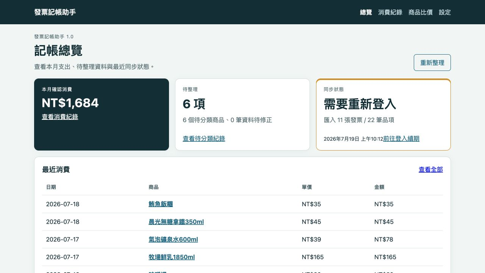
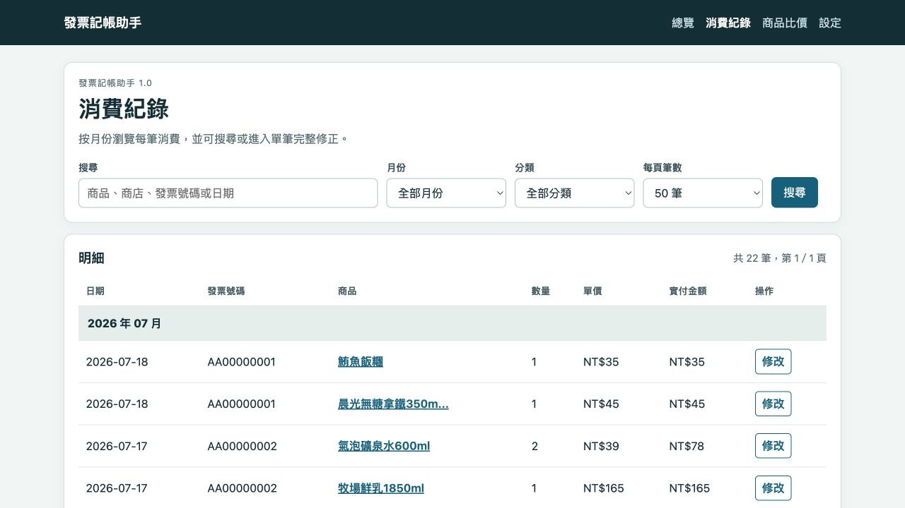
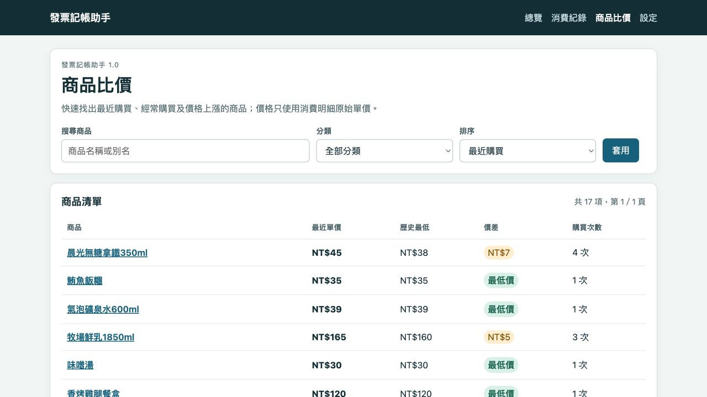
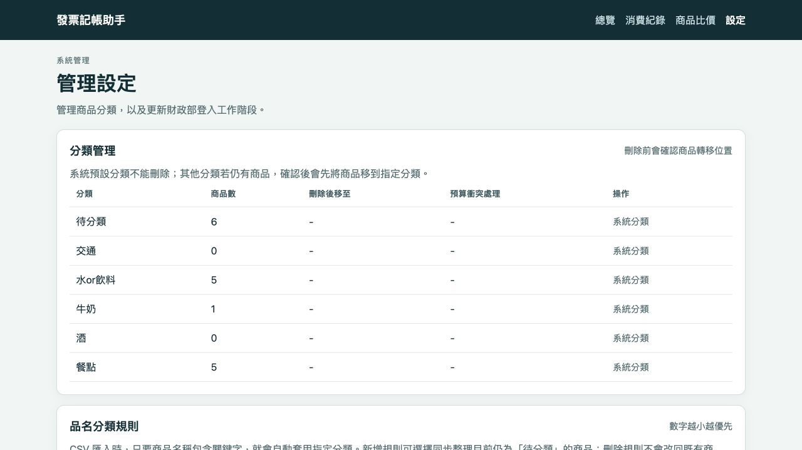
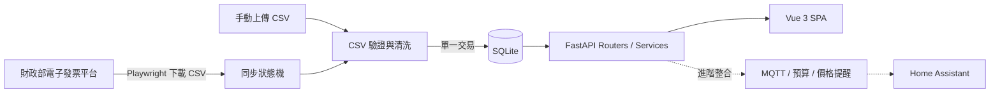

# 發票記帳助手

> 專案目錄：`side project/einvoice_ledger/`  
> 版本：`1.0.0`  
> 型態：單一使用者、私有部署、Home Assistant App

發票記帳助手是一套以台灣財政部電子發票消費明細為資料來源的私人記帳工具。它把功能集中在發票同步、消費查詢、錯誤修正與歷史單價比較，避免日常介面變成複雜的財務管理系統。

系統不把資料送往第三方記帳服務；SQLite 資料庫、登入工作階段與診斷檔都保存在自己的設備中。可先以 Docker 在 macOS/Linux 執行，正式環境則可安裝為 Home Assistant App，透過 Ingress 使用 Vue 3 介面。

## 功能亮點

### 本機 OCR 自動預填財政部驗證碼

登入工作階段失效時，設定頁會載入財政部登入畫面並擷取圖形驗證碼。`ddddocr` 只在本機／容器內離線辨識，辨識結果會自動填入「圖形驗證碼」欄位；使用者核對手機號碼、密碼與辨識結果後，再按下登入並保存工作階段。

- 驗證碼圖片不會傳送給第三方 OCR 服務。
- 手機號碼與密碼不寫入資料庫、日誌或瀏覽器儲存空間。
- OCR 只負責辨識與預填，不會自動送出登入，也不會繞過 Cloudflare 或其他安全驗證。
- 辨識錯誤時可直接修改欄位或重新載入驗證碼。

### 可搜尋、可修正的消費歷史

每一筆發票商品都會保留為消費紀錄，可依月份、分類與關鍵字搜尋。清單顯示消費日期、發票號碼、商品、數量、原始單價與金額；點選「修改」後可修正財政部 CSV 中錯誤的日期、品名、數量、單價及金額，且原始資料仍保留供還原與稽核。

不同商店若使用不同品名，可由使用者合併到同一個商品名稱。合併後的紀錄會共用分類及完整價格歷史，不會因店家命名不同而拆成多個商品。

### 自動建立個人商品最低價

每次 CSV 匯入或背景同步完成後，系統會自動重新彙整同一商品的有效消費明細，產生：

- 消費總次數
- 最近購買日期與最近單價
- 歷史最低、最高及平均單價
- 最近價格與歷史最低的價差
- 各商店最低／最高／平均單價
- 最近購買明細及價格趨勢

比價預設使用財政部 CSV 的「消費明細單價」；若使用者已修正該筆錯誤單價，則使用修正值。系統不拿發票總額當商品價格、不換算每 100g／100ml，也不把尚未分攤的折扣猜測到商品上。作廢發票、負數折扣列及低信心待確認資料不會污染比價結果。

商品亦可設定目標單價及「歷史新低」提醒。新消費低於過往所有有效購買單價時會建立通知事件，同一筆明細即使被重複同步也不會重複通知。

## 快速開始

```sh
git clone <repository-url>
cd <repository-directory>/einvoice_ledger
cp .env.example .env
docker compose up -d --build
```

第一次安裝、區網連線、資料搬移與故障排除請閱讀 [SETUP.md](SETUP.md)。

## 介面與日常流程

系統刻意把日常導覽縮成四個入口：`總覽｜消費紀錄｜商品比價｜設定`。預算、折扣分攤、資料品質與 MQTT 等能力仍保留在後端，但不佔據日常操作介面。

### 1. 總覽

顯示本月消費、待整理數量、同步狀態與最近五筆消費。CSV 匯入和「立即同步」也集中在同一頁。



### 2. 消費紀錄

依月份、分類或關鍵字搜尋；財政部資料若有錯誤，可直接修正單筆日期、發票號碼、商品、數量、單價與金額。



### 3. 商品比價

清單只保留商品、最近單價、歷史最低、價差與購買次數。所有價格都來自 CSV 的「消費明細原始單價」，不計算每 100g／100ml，也不使用發票總額或折後單價。



### 4. 設定

管理商品分類、品名關鍵字規則與財政部登入續期。版本、MQTT、備份及診斷資訊收在預設折疊的「進階系統設定」。



## 核心功能

### 電子發票匯入與同步

- 每日 04:15（Asia/Taipei）同步當月與上月。
- 可手動上傳財政部 UTF-8 BOM CSV 作為備援。
- 重複下載或匯入相同資料不會重複計算。
- 登入失效時停止同步並要求人工續期，不會重複嘗試 CAPTCHA。
- 兩個月份使用單一資料庫交易；任一月份失敗即完整 rollback。
- CSV 會驗證月份、標題、欄數、日期、數量、單價與金額。

### 消費修正與商品整理

- 原始發票資料永久保留，人工修正另外記錄，可隨時還原。
- 修正後名稱空白時使用原始品名。
- 不同商店的同一商品可手動合併到共同名稱。
- 同名商品共用分類與歷史價格。
- 負數折扣保留但不進入商品比價。
- 作廢與待確認資料不污染支出和價格統計。

### 品名分類規則

設定頁可新增 `關鍵字 → 分類`，例如 `果汁 → 水or飲料`，並選擇是否立即套用到既有待分類商品。內建規則包含：

- 飯、麵、三明治、餐盒、飯糰 → 餐點
- 茶、水、可樂、飲料 → 水or飲料
- 乳 → 牛奶
- 汽油、無鉛 → 交通
- 啤酒、威士忌、伏特加、高粱 → 酒

### 保留的進階能力

下列能力仍有資料表、API 與測試，但不顯示在主要導覽：

- 多商品折扣平均分攤
- 分類月預算與門檻通知
- 商品目標價及歷史新低提醒
- CSV 資料品質問題追蹤
- MQTT Discovery 與 Home Assistant 通知

需要時可重新開啟入口，不必重新設計資料庫。

## 系統架構



### 技術組成

| 區域 | 技術 |
|---|---|
| 後端 | Python 3.12、FastAPI、SQLAlchemy、Alembic、APScheduler |
| 前端 | Vue 3、TypeScript、`<script setup>`、Vue Router、Chart.js |
| 資料庫 | SQLite、foreign keys、WAL、busy timeout |
| 自動化 | Playwright／Chromium、ddddocr 本機 CAPTCHA 預填 |
| Home Assistant | App Ingress、MQTT Discovery、Automation package |
| 測試 | pytest、Vitest、Playwright E2E、Docker smoke test |

### 後端分層

- `routers/`：API 請求驗證與回應序列化。
- `*_service.py`：同步、預算、提醒、資料品質、MQTT 等商業邏輯。
- `models.py`：SQLAlchemy 資料模型。
- `importer.py`：CSV 驗證、清洗、去重及資料品質紀錄。
- `crawler.py`：財政部登入續期、日期選取、查詢及下載。
- `alembic/`：資料庫 migration；不以臨時 `ALTER TABLE` 維護正式 schema。

## 主要資料表

| 資料表 | 用途 |
|---|---|
| `invoices` | 發票日期、號碼、商店、金額、狀態及作廢資訊 |
| `invoice_lines` | 原始品名、數量、單價、金額、折扣及品質狀態 |
| `invoice_line_corrections` | 使用者對單筆消費的人工修正 |
| `stores` | 賣方統編、店名、連鎖品牌、分店與地址 |
| `products` / `product_aliases` | 標準商品與不同商店使用的品名別名 |
| `category_rules` | 人工、統編、品名與商家分類規則 |
| `discount_allocations` | 折扣與商品明細的分攤關係 |
| `sync_runs` / `sync_run_events` | 同步結果與逐階段狀態 |
| `data_quality_issues` | CSV 異常、修復信心及人工處理結果 |
| `category_budgets` | 分類月預算與生效月份 |
| `price_alerts` | 目標價與歷史新低設定 |
| `notification_events` | 通知事件與去重鍵 |

## 專案目錄

```text
side project/
├── README.md                    # Side projects 索引
├── repository.yaml             # Home Assistant App repository
├── .github/workflows/ci.yml     # CI
└── einvoice_ledger/             # 發票記帳助手專案根目錄
    ├── README.md
    ├── environment.yml
    ├── docker-compose.yml
    ├── Dockerfile
    ├── config.yaml
    ├── app/
    ├── alembic/
    ├── frontend/
    ├── homeassistant/
    ├── tests/
    ├── scripts/
    ├── docs/screenshots/
    └── data/                    # 私有執行資料，不提交 Git
```

## 本機開發

### 需求

- macOS 或 Linux
- Anaconda／Miniconda
- Docker Desktop（正式映像與整合測試使用）

### 建立專案內 Conda 環境

```sh
cd <repository-directory>/einvoice_ledger
conda env create --prefix ./.conda --file environment.yml
./.conda/bin/playwright install chromium
./.conda/bin/npm --prefix frontend install
```

Python 與 Node 環境都固定在 `einvoice_ledger/.conda/`，不使用 Anaconda base 或全域 npm 套件。

### 啟動開發服務

```sh
./.conda/bin/npm --prefix frontend run build
E_INVOICE_DATA_DIR=./data ./.conda/bin/uvicorn app.main:app \
  --reload --host 127.0.0.1 --port 8000
```

開啟 <http://127.0.0.1:8000>。若要使用 Vite hot reload：

```sh
./.conda/bin/npm --prefix frontend run dev
```

Vite 會將 `/api` 請求代理到 FastAPI 的 8000 port。

### 匯入既有 CSV

```sh
E_INVOICE_DATA_DIR=./data ./.conda/bin/python \
  scripts/import_csv.py /path/to/*.csv
```

## Docker 執行

在 `einvoice_ledger/` 目錄執行：

```sh
docker compose up --build -d
docker compose ps
```

本機介面位於 <http://127.0.0.1:8000>，正式資料保存在 `einvoice_ledger/data/`。

### 使用手機從區域網路連線

Docker Compose 將 Web App 綁定至 `0.0.0.0:8000`。手機與這台電腦連到同一個 Wi-Fi 後，使用電腦的區網 IP 開啟：

```text
http://<Mac 的區網 IP>:8000/#/dashboard
```

若 macOS 防火牆詢問是否允許 Docker 接受連入連線，需選擇允許。此設定沒有 HTTPS 或使用者登入保護，只適合可信任的家庭區網；不要在路由器設定 8000 port forwarding，也不要直接暴露到網際網路。Home Assistant 正式環境仍建議使用 Ingress。

## Home Assistant OS

1. 將包含 `repository.yaml` 與 `einvoice_ledger/` 的 repository 加入 Home Assistant App Store。
2. 安裝「發票記帳助手」。
3. 啟動 App 後使用 Ingress 開啟介面，不需開放外網 port。
4. 若需要 HA 感測器與通知，安裝 Mosquitto Broker 並在設定頁填入 MQTT 連線。
5. 將 `homeassistant/einvoice_package.yaml` 放入 HA packages，並參考 `homeassistant/dashboard.yaml` 建立卡片。

MQTT 未安裝或中斷時，Web App 仍可完整記帳；尚未發布的通知保留在資料庫，恢復連線後補送。

<details>
<summary>進階：MQTT Discovery 實體</summary>

- `sensor.einvoice_last_sync`
- `sensor.einvoice_month_total`
- `sensor.einvoice_budget_remaining`
- `sensor.einvoice_uncategorized_count`
- `sensor.einvoice_data_quality_issues`
- `sensor.einvoice_unallocated_discounts`
- `sensor.einvoice_last_price_alert`
- `binary_sensor.einvoice_login_required`
- `binary_sensor.einvoice_sync_problem`

</details>

## API 摘要

| Method | Path | 用途 |
|---|---|---|
| `POST` | `/api/imports/csv` | 手動匯入 CSV |
| `POST` | `/api/sync` | 建立或取得進行中的同步 |
| `GET` | `/api/sync-runs/{id}` | 查詢同步階段與結果 |
| `GET` | `/api/purchases` | 搜尋消費紀錄 |
| `PUT` | `/api/purchases/{id}` | 修正單筆消費 |
| `GET` | `/api/products` | 商品名稱搜尋 |
| `GET` | `/api/product-comparisons` | 商品歷史單價比較 |
| `GET/PUT/DELETE` | `/api/products/{id}/price-alert` | 價格提醒 |
| `GET/PUT/DELETE` | `/api/budgets/{category}` | 分類預算 |
| `GET` | `/api/budgets/summary` | 月度預算摘要 |
| `GET/POST` | `/api/data-quality` | 資料品質查詢與處理 |
| `GET` | `/api/notifications` | 通知紀錄 |
| `GET` | `/api/system` | 版本、MQTT、備份與診斷狀態 |

完整互動式 API 文件可在開發環境開啟 `/docs`。

## 測試

```sh
./.conda/bin/python -m pytest -q
./.conda/bin/npm --prefix frontend run test -- --run
./.conda/bin/npm --prefix frontend run build
docker build -t einvoice-ledger:1.0.0 .
```

測試涵蓋地址逗號、欄位位移、空數量、空單價、負折扣、作廢、重複匯入、商品別名、兩月份 rollback、登入失效、下載空檔、預算門檻、價格提醒及 MQTT 斷線補送。

## 資料與安全

- 資料庫：`data/einvoice.db`
- 財政部工作階段：`data/browser-state.json`，權限 `0600`
- migration 備份：`data/backups/einvoice-pre-v1-*.db`，保留最近五份
- 錯誤截圖只保留必要可見範圍，先遮蔽手機、Email、載具及表單內容
- 診斷截圖及 metadata 權限 `0600`，七天後自動刪除
- `browser-state.json`、Cookie、密碼與診斷圖不進入 Home Assistant 備份
- 手機條碼密碼只存在單次登入請求記憶體，不寫入資料庫或日誌
- ddddocr 僅在容器本機預填 CAPTCHA；送出前仍由使用者核對
- 不使用 OCR 繞過 Cloudflare 或其他安全驗證
- App 不使用 host network 或 privileged mode；Docker 開發模式只開放家庭區網的 8000 port，不應設定公網轉發

## 備份與回復

正式 migration 前會自動使用 SQLite backup API 建立備份。若升級後核心數量或月度金額不一致：

1. 停止目前容器。
2. 保留異常資料庫供診斷。
3. 將切換前備份還原為 `data/einvoice.db`。
4. 使用保留的舊 Docker image 啟動。
5. 核對發票、明細、人工修正、別名及折扣分攤數量。

## 目前範圍

- 單一手機條碼、單一使用者。
- 個人實際購買歷史，不整合即時電商或第三方公開價格。
- SQLite 私有部署，不提供雲端帳號服務。
- 不計算每 100g／100ml。
- 不自動判斷無法確定的多商品折扣歸屬。
- 無法確定的髒資料會計入總覽的「待整理」，再由使用者進行確認或修正。

## 授權與資料提醒

程式碼與電子發票資料應分開管理。`data/`、CSV、資料庫、診斷截圖及登入工作階段都可能包含個人消費資訊，不應提交到公開 repository。
